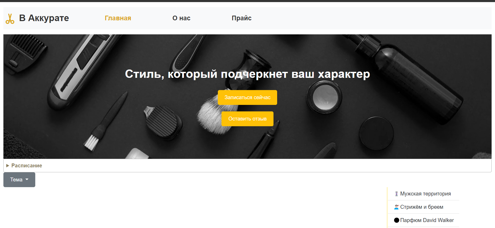

# V Akkurate

## Project Description
The V Akkurate project was developed with the goal of creating a convenient web application for making appointments for hairdressing services in a barbershop. This web application was developed for clients of the V Akkurate barbershop. Thanks to the project, new opportunities are provided for online registration, for viewing services, for learning about the barbershop, etc.

### Purpose
The V Akkurate project is designed with the primary objective of providing a user-friendly web application for scheduling appointments for hairdressing services at the V Akkurate barbershop. Tailored specifically for the clientele of the V Akkurate barbershop, this project introduces a range of new opportunities aimed at enhancing the overall customer experience.

### Functionality
- The web application offers a convenient platform for clients to schedule appointments for various hairdressing services online. This functionality streamlines the booking process, making it easy and efficient for clients to secure their preferred time slots.
Service Overview:

- Clients have the ability to explore and view the diverse range of services offered by V Akkurate. This feature ensures that customers are well-informed about the available hairdressing services, allowing them to make informed decisions based on their preferences and needs.
Barbershop History:

- Through the V Akkurate web application, clients gain access to an improved and seamless online experience. The project's features aim to enhance user convenience, making it easier for clients to engage with the barbershop's services and offerings from the comfort of their own devices.
By achieving these goals, the V Akkurate project not only simplifies the appointment booking process but also enriches the overall interaction between clients and the barbershop. The web application serves as a valuable tool for clients to explore services, schedule appointments, and connect with the history and identity of V Akkurate.

### Target Users
The V Akkurate project is crafted with a specific focus on catering to the following target users:

Clients of V Akkurate Barbershop:

- The primary audience for this project comprises the existing and potential clients of V Akkurate barbershop. The web application aims to provide a tailored and convenient experience for individuals seeking hairdressing services at V Akkurate.
Individuals Interested in Hairdressing Services:

- The project extends its reach to individuals who have an interest in exploring and availing professional hairdressing services. Whether they are looking for traditional haircuts, styling, or grooming services, the web application welcomes individuals with diverse preferences and needs.
Users Who Prefer Online Appointment Booking:

- The web application is designed to appeal to users who prefer the convenience of online appointment scheduling. Individuals who value the flexibility of choosing appointment slots, exploring services virtually, and engaging with the barbershop online will find the project particularly beneficial.
Clients Seeking Information About V Akkurate:

- The project caters to users who wish to learn more about the history and identity of V Akkurate barbershop. Clients seeking a deeper connection with the establishment, interested in its journey, values, and unique attributes, form an integral part of the target audience.
By focusing on these target users, the V Akkurate project aims to provide a comprehensive and personalized experience, meeting the specific needs and preferences of clients and individuals interested in professional hairdressing services. The web application strives to create a user-centric platform that enhances engagement, convenience, and connection with V Akkurate barbershop.

## Participants
- Kanay Bekzat 
- Sagandykov Ramin
- Kaskyrbayev Mukhammed

## First Page

## Tools Used
Here's a list of tools and technologies commonly used for a project that involves HTML, CSS, Bootstrap, and JavaScript, along with links to their official sources:

1. **HTML:**
   - **Description:** HyperText Markup Language for structuring web content.
   - **Link to Source:** [HTML MDN Web Docs](https://developer.mozilla.org/en-US/docs/Web/HTML)

2. **CSS:**
   - **Description:** Cascading Style Sheets for styling web content.
   - **Link to Source:** [CSS MDN Web Docs](https://developer.mozilla.org/en-US/docs/Web/CSS)

3. **Bootstrap:**
   - **Description:** Front-end framework for responsive and mobile-first web development.
   - **Link to Source:** [Bootstrap Official Website](https://getbootstrap.com/)

4. **JavaScript:**
   - **Description:** Programming language for adding interactivity and dynamic behavior to web pages.
   - **Link to Source:** [JavaScript MDN Web Docs](https://developer.mozilla.org/en-US/docs/Web/JavaScript)

5. **Visual Studio Code (VSCode):**
   - **Description:** Lightweight and powerful code editor.
   - **Link to Source:** [Visual Studio Code](https://code.visualstudio.com/)

6. **Git:**
   - **Description:** Distributed version control system for tracking changes in source code.
   - **Link to Source:** [Git Official Website](https://git-scm.com/)

7. **GitHub:**
   - **Description:** Web-based platform for hosting and collaborating on Git repositories.
   - **Link to Source:** [GitHub](https://github.com/)

8. **Node.js:**
   - **Description:** JavaScript runtime for server-side development.
   - **Link to Source:** [Node.js Official Website](https://nodejs.org/)

9. **Postman:**
    - **Description:** API development and testing tool.
    - **Link to Source:** [Postman Official Website](https://www.postman.com/)

10. **Stack Overflow:**
    - **Description:** Online community for programming and web development discussions.
    - **Link to Source:** [Stack Overflow](https://stackoverflow.com/)
